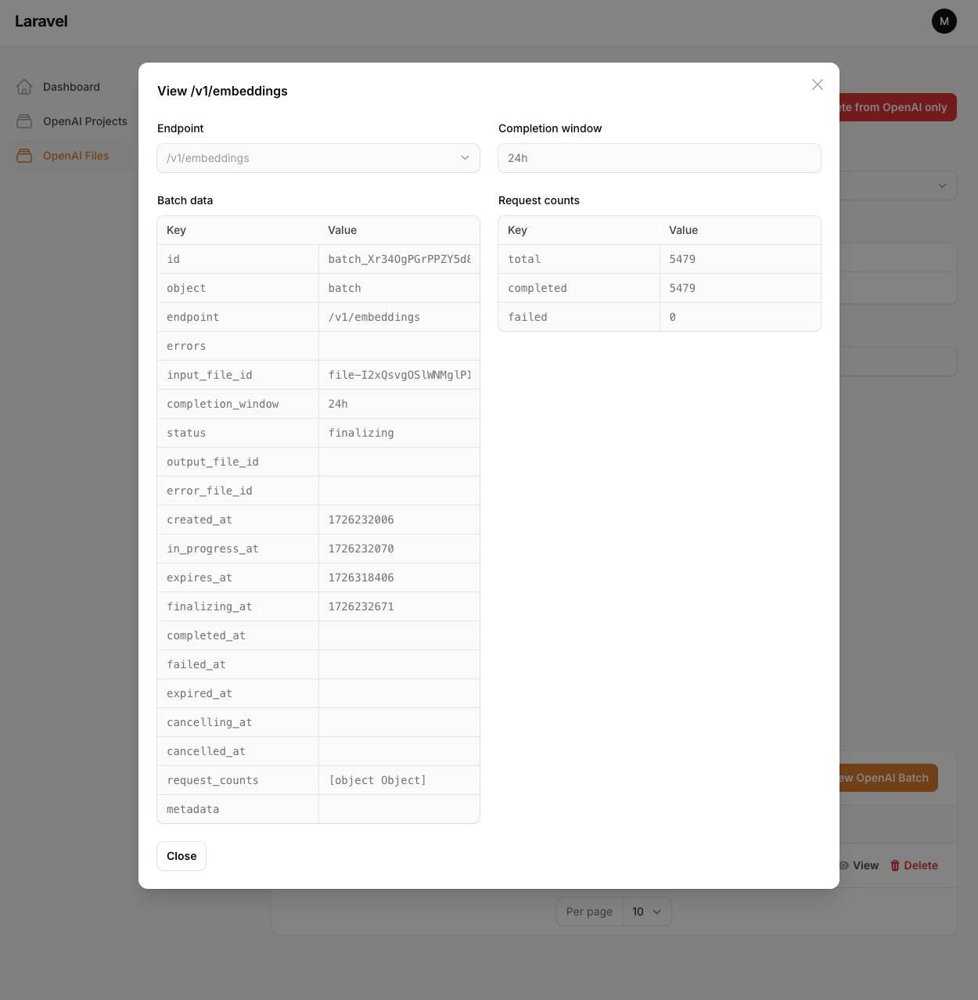

# OpenAI files and batches management 

[](https://packagist.org/packages/moontechs/openai-management)
[](https://packagist.org/packages/moontechs/filamentphp-openai-management)


This package is used to easily manage files and batches via the OpenAI API. The flow is described [here](https://platform.openai.com/docs/guides/batch/overview).

## Installation

You can install the package via composer:

```bash
composer require moontechs/openai-management
```

You need to publish and run the migrations with:

```bash
php artisan vendor:publish --tag="openai-management-migrations"
php artisan migrate
```

You can publish the config file with:

```bash
php artisan vendor:publish --tag="openai-management-config"
```

This is the contents of the published config file:

```php
return [
    'disk' => 'local', // you can customize used disk and upload/download folders
    'directory' => 'openai-files',
    'download-directory' => 'openai-files-downloads',

    'select-options' => [
        'file-purpose' => [
            'batch' => 'batch',
            'assistants' => 'assistants',
            'fine-tune' => 'fine-tune',
        ],
        'batch-endpoint' => [
            '/v1/chat/completions' => '/v1/chat/completions',
            '/v1/embeddings' => '/v1/embeddings',
            '/v1/completions' => '/v1/completions',
        ],
    ],
];
```

## Usage

Add a plugin to your Panel Provider
```php
use Moontechs\OpenAIManagement\OpenAIManagementPlugin;

->plugins([
    new OpenAIManagementPlugin,
])
```

### Jobs

[Schedule](https://laravel.com/docs/11.x/scheduling) the following CLI commands:

* `php artisan openai-management:files:update` - uploads new files to an OpenAI storage and updates already uploaded files statuses
* `php artisan openai-management:batches:update` - sends files batch processing requests and updates statuses of the old requests. In case there are no batches in progress, it will send the next batch process request.
* `php artisan openai-management:processed-files:download` - downloads already processed files

### UI (step by step flow)

1. **Add a project**
   * Reffer to the OpenAI [documentation](https://help.openai.com/en/articles/9186755-managing-your-work-in-the-api-platform-with-projects) to create new projects or obtain the ID and [key](https://help.openai.com/en/articles/9186755-managing-your-work-in-the-api-platform-with-projects#h_9ac8d4e902) of an existing one.
   * Note: The OpenAI key will be encrypted. Do not regenerate the Laravel `APP_KEY`.


2. **Upload files**
   * Check the [documentation](https://platform.openai.com/docs/guides/batch/getting-started) to understand the file structure.
   * Multiple file uploads are supported.
   * Tags are for internal use only and do not affect API calls.


3. **Request Batch Processing**
   * If a file is in the `processed` status you can request batch processing.


4. **Check Batch Status**
   * Batch processing can take up to 24 hours. You can check the batch status.



5. **Download Processed Files**
   * When the batch is completed, a background job downloads the files to the server. You can then download them locally (a download button will appear).


## Credits

- [Moontechs](https://github.com/moontechs)
- [All Contributors](../../contributors)

## License

The AGPL-3.0 License. Please see [License File](LICENSE.md) for more information.
